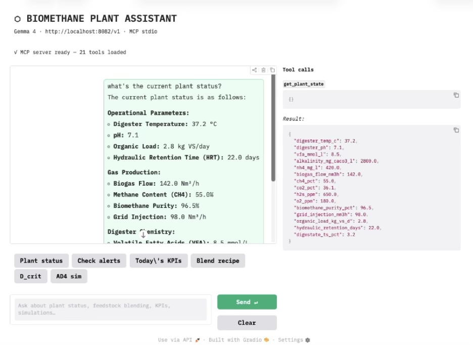

# Biomethane Operator Assistant

MCP (Model Context Protocol) server and CLI for anaerobic digestion plant operations, featuring a physics-based AD4 simulator, Ensemble Kalman Filter state estimation, SCADA ingestion pipeline, and an LLM-powered chat interface.

## Why This Project Matters

Biomethane and anaerobic digestion facilities rely on continuous monitoring of process variables, feedstock inputs, gas production, and operational alerts. This project explores how AI-assisted tools, process simulation, state estimation, and retrieval-augmented generation can support operators by improving access to technical information and helping structure operational analysis.

## Features

- **MCP Server** — 25+ tools accessible via stdio or HTTP (`src/bio_methane_operations_mcp_server_v5.py`)
  - Live plant state monitoring with CUSUM anomaly detection
  - Rule-based threshold alerts (lab-scale and industrial profiles)
  - Feedstock blending with BMP, C/N, and OLR calculations
  - KPI rollups (daily/weekly/monthly production summaries)
- **AD4 Simulator** — 4-state AM2 anaerobic digestion ODE model (Bernard 2001, Benyahia 2012)
- **EnKF State Estimator** — Ensemble Kalman filter for hidden state (S2, X2) estimation
- **CLI** (`bio_cli.py`) — All core operations as standalone commands
- **Chat UI** (`biomethane_chat.py`) — Gradio interface with intent routing
- **SCADA Ingestion** — Auto-detect vendor, fuzzy column mapping, CUSUM filtering
- **RAG Pipeline** — Retrieval-augmented generation over process documentation

## Example Use Cases

- Check current plant state and KPI summary
- Detect unusual process behavior using CUSUM anomaly detection
- Estimate hidden process states using Ensemble Kalman filtering
- Ask operational questions through a RAG-enabled chat interface
- Compare feedstock blending options using BMP, C/N, and OLR calculations

## Quick Start

```bash
pip install -r requirements.txt
python src/bio_methane_operations_mcp_server_v5.py
```

See [SETUP_GUIDE.md](SETUP_GUIDE.md) for full installation and configuration.

## Requirements

- Python 3.10+
- [MCP Python SDK](https://github.com/modelcontextprotocol/python-sdk) (`mcp>=1.0.0`)
- llama.cpp with MCP support (for local LLM inference)
- Gemma 4 or any OpenAI-compatible model

## Screenshot



## License

MIT
